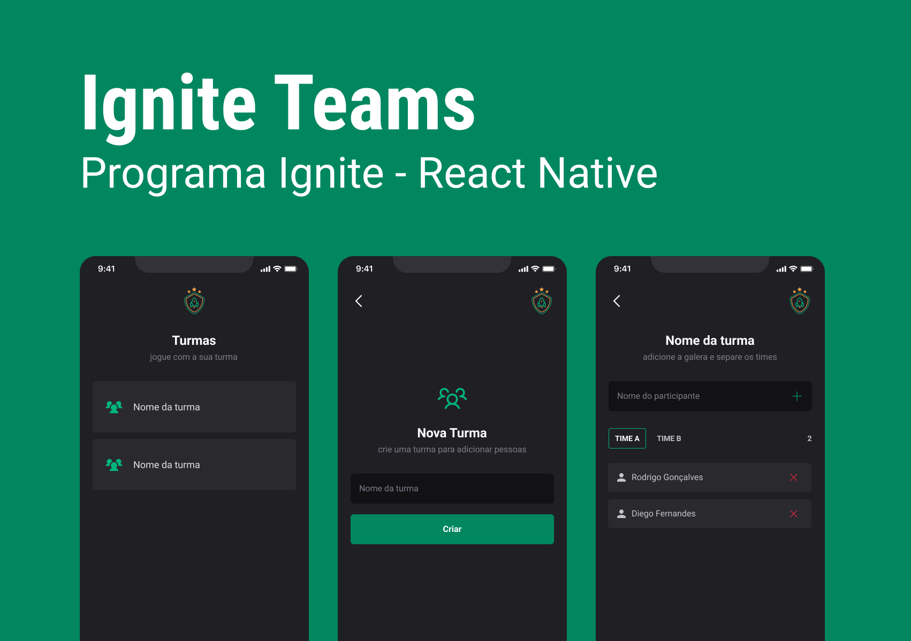

<h4 align="center">

</h4>

<h4 align="center">
    <p align="center">
      <a href="#-about">About</a>&nbsp;&nbsp;&nbsp;|&nbsp;&nbsp;&nbsp;
      <a href="#-technologies">Technologies</a>&nbsp;&nbsp;&nbsp;|&nbsp;&nbsp;&nbsp;
      <a href="#-how-to-run-the-project">Run</a>&nbsp;&nbsp;&nbsp;|&nbsp;&nbsp;&nbsp;
      <a href="#-info">Info</a>&nbsp;&nbsp;&nbsp;|&nbsp;&nbsp;&nbsp;
      <a href="#-license">License</a>
  </p>
</h4>

<h1 align="center">
    

</h1>

## 🔖 About

Ignite Teams é um aplicativo mobile construído com React Native que permite aos usuários criar e gerenciar equipes para várias atividades. Seja organizando um time esportivo, um grupo de estudo ou qualquer outro empreendimento em grupo, o Ignite Teams oferece uma plataforma intuitiva para criar novas turmas e adicionar jogadores aos Times A e B.

Com o Ignite Teams, você pode organizar suas equipes e jogadores de forma fácil e eficiente, enquanto garante que todos os dados sejam persistidos usando o Async Storage, uma solução de armazenamento local. O aplicativo também incorpora uma navegação suave por meio do React Navigator, facilitando a alternância entre as telas e a gestão das suas equipes de forma eficaz.

#### Principais Recursos

Criar Novas Turmas: Crie rapidamente novas turmas ou grupos para qualquer finalidade, permitindo que você organize suas equipes de forma eficiente.

Gerenciamento de Equipes: Atribua jogadores aos Times A e B, permitindo distribuir os membros de forma equilibrada e acompanhar o progresso e desempenho de cada um.

Armazenamento Persistente de Dados: Utilize o Async Storage para armazenar todos os dados das suas equipes e jogadores com segurança, garantindo acesso contínuo às informações mesmo após fechar o aplicativo.

Navegação Descomplicada: Aproveite o sistema de navegação intuitivo do React Navigator, que permite mover-se entre as telas com facilidade e acessar diferentes recursos de forma simples.

## 🚀 Technologies

- [ReactNative](https://reactnative.dev/)
- [Typescript](https://www.typescriptlang.org/)
- [Expo](https://expo.dev/)
- [StyledComponents](https://styled-components.com/)
- [AsyncStorage](https://react-native-async-storage.github.io/async-storage/)

## 🏁 How to run the project

```sh
# Clone the repository
git clone https://github.com/rafinhaa/ignite-teams-app.git
cd ignite-teams-app

# Install the dependencies
yarn install

# Start the Android application
yarn android

# Start the iOS application
yarn ios
```

## ℹ️ Info

## 📄 Changelog

## 📝 License

[MIT](LICENSE)

**Free Software, Hell Yeah!**
